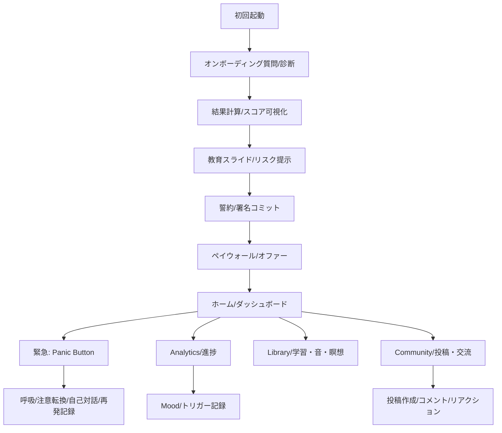
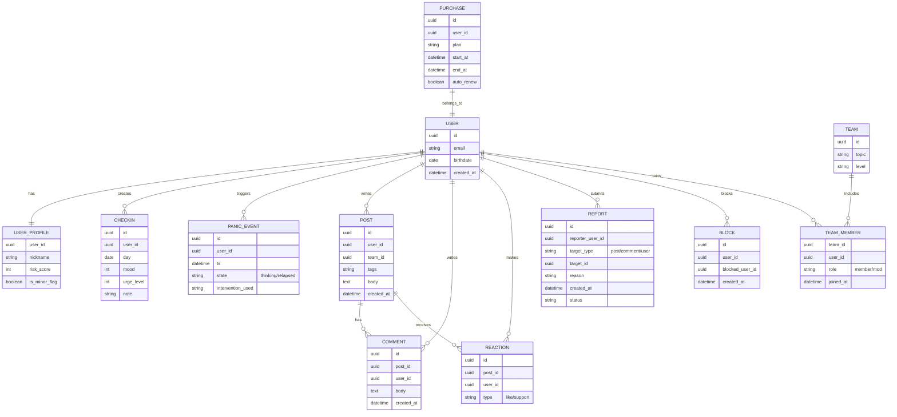

# quittrapp.com のUIパターンとピアサポート設計インサイト  
現在日時（JST）：2026-02-25

## エグゼクティブサマリー

【結論】  
quittrapp.com（QUITTR）のUIは、(a) “緊急介入（Panic Button）” を常時目立つ位置に固定し、(b) ストリーク可視化・ゲーミフィケーション（Seed/Orbs/リング）を中核に置き、(c) コミュニティ（匿名フォーラム/チャット系）へ「今ここで書き込む」導線を強く押し出す、という3点が“継続”に最適化された設計です。公式/ストア/スクリーン解析から読み取れる範囲では、あなたの日本国内向け『ポルノやめる系』プロダクトに取り込む際は、**「緊急介入 → 自己調整 → ピア（仲間）へ接続 → 習慣化ループ」**の順にUIを束ねるのが、LTV最大化（離脱防止・復帰促進）に直結します。citeturn1view0turn6view3turn11view5turn25view0turn20search0

【根拠】  
QUITTR公式は、主要機能としてPanic Button、Community、Personalized Plan、AI（Melius）、Advanced Blocker等を明示し、コミュニティは「secure, anonymous」かつアプリ内の複数箇所（匿名フォーラム、daily check-ins、private groups等）に統合される旨を記述しています。citeturn1view0turn14view0  
実際の画面（Google Playスクリーンショット/スクリーン解析）では、ホーム画面下部に幅いっぱいの“Panic Button”が固定され、コミュニティ画面はタグ（例：Forum）と投稿作成（＋）導線が視覚的に強調されています。citeturn6view2turn6view3turn11view5turn10view0  
ピアサポートの有効性については、依存症領域のピア支援（Peer Recovery Support Services）が物質使用の低減・再発低下・治療継続（retention）改善に寄与するという系統的レビューが複数あります。citeturn20search20turn20search16turn20search8 また、オンラインの即時メッセージング型グループ支援が再発予防に有効性を示したRCT（喫煙の再発予防・カウンセラーによるモデレーション付き）もあり、UI/運用で「モデレーション」が成否を分ける示唆があります。citeturn20search37turn22search1

【注意点・例外】  
QUITTRの一部UIは「羞恥・恐怖訴求」に寄る可能性があり（例：Panic Button画面の強いメッセージ）、日本市場ではユーザーの自己効力感を毀損しうるため、同型UIでもコピー/トーン/選択肢設計を調整すべきです。citeturn11view6turn7view0  
また、UGC（投稿/チャット）を扱う場合、ストアポリシー上「通報・ブロック・適切なモデレーション」が実装必須です。citeturn22search1turn22search0turn22search9 日本法対応としては、個人情報（回復ログ・性的行動に関する自己申告は“センシティブ”になり得る）を扱うため、個人情報保護法の開示等対応や安全管理措置を前提に、最小収集・目的明示・削除導線を設計に内蔵する必要があります。citeturn21search7turn7view1

【出典】主要一次・準一次は本文末の「出典」にURL一覧を掲載。

【確実性：中】  
UIスクリーンはストア/スクリーン解析/公式サイト静的画像に依存するため、アプリ内全画面の網羅は未達（ただし主要導線・主要パターンは複数ソースで一致）。citeturn6view0turn10view0turn1view0turn9view0

## 調査範囲と方法

本調査は、(1) quittrapp.com公式（機能・FAQ・規約・プライバシー・購読条件）、(2) ストア情報（Google Play/Apple App Storeの説明・レーティング・IAP表示）、(3) スクリーン解析の公開ページ（ScreensDesign）および公開スクリーンショット、(4) ピアサポート/デジタル継続支援の学術・公的ガイド（系統的レビュー、SAMHSA/NIST/OWASP、ストアUGCポリシー）を優先ソースとして収集し、UIパターンを「画面目的」「主要CTA配置」「継続ループへの寄与」で分解しました。citeturn1view0turn3view1turn10view0turn20search20turn22search1  
なお、Apple App Storeのスクリーンショットはページ構造上、取得できる国/形式により参照が不安定でした（IAP/年齢レーティング等は取得できる地域ページを採用）。citeturn9view0turn3view0

## QUITTRの公式機能一覧と主要UXフロー  
（UIパターン・ボタン配置にフォーカス）

### 公式に明示された主要機能  
QUITTR公式サイト上の「Explore The Features」およびFAQ記述から、コア機能は少なくとも以下が明示されています：Panic Button、Community、Personalized Plan（オンボーディング評価に基づく設計）、Learn（教育コンテンツ）、AI Therapist/AI Companion（Melius）、Advanced Blocker（OS統合型の遮断を謳う）、Tracker/Analytics、ゲーミフィケーション（Life Tree/Orbs、バーチャル通貨等を説明）。citeturn1view0turn14view0turn7view1  
また、アクセス手段としてiOS/Androidアプリに加えてChrome拡張が記載され、拡張はブロックリスト/セーフサーチ等を提供し、無料版は最大3サイトまでブロック可能と説明されています。citeturn24search1turn24search0

### 主要UXフロー（推定ではなく「観測できる導線」ベース）
以下は、ストア/スクリーン解析/公式静的画像から“画面として確認できるもの”を中心にしたフローです。citeturn10view0turn6view3turn11view5turn3view1



### 主要画面のスクリーン構成（ボタン位置・視覚階層）

#### ダッシュボード（ホーム）のボタン配置  
観測できるホーム系UIは、「上：進捗の象徴（Seed/Orbs/日数）」「中：主要指標（Relapses / Porn Free For / Til Sober等）」「下：クイックアクション（Pledge/Mediate/Reset/Melius）」「最下：幅いっぱいのPanic Button（強いコントラスト色）」＋「ボトムナビ（Home/Analytics/Library/Community/Profile）」という階層です。citeturn11view5turn2view0  
この配置は、迷ったときの行動が「(1) Panic Button」または「(2) 4つの丸ボタン」へ収束しやすく、探索コストを最下段に封じ込める設計です（＝“次の1手”を固定するUI）。citeturn11view5turn1view0

#### Panic Button（緊急介入）のボタン配置  
Panic Button画面は、(a) 上部に閉じる/補助、(b) 中央にカメラや自己像（ScreensDesignの説明ではフロントカメラ活用）、(c) 強いメッセージ、(d) 下部に状況選択ボタン（例：「I Relapsed」「I’m thinking of relapsing」）という二択/三択の“短距離UI”になっています。citeturn11view6turn10view0turn6view3  
この種の配置は、認知負荷が高い瞬間（衝動時）に「選択肢を極端に絞る」ことで行動を中断させる典型的な“エマージェンシーUI”です（推測ではなく、画面構造からの設計解釈）。citeturn6view3turn11view6

#### Community（ピア接続）の導線配置  
コミュニティ画面のスクリーンショットでは、上部にカテゴリ（例：Forum）を見せ、投稿カードを縦積みし、右下に「＋」のフローティングボタン（投稿作成）を配置しています。citeturn6view2  
公式FAQではコミュニティが匿名フォーラム/チェックイン/プライベートグループ等へ統合される旨が記載されており、UI上も“単独タブ”ではなくアプリ全体へ散らす方針が示唆されます。citeturn1view0turn7view1

#### Learn / Library / Relapse Prevention / Mood（自己調整系）の配置  
Google Playの公式スクリーンショットから、Learnは縦並びの大きいピル/カードボタンを採用し（カテゴリ選択を高速化）、Libraryはリスト×再生（サウンドスケープ等）の“メディア棚UI”、Relapse Preventionはタイル型（複数の介入を並列提示）、Moodは絵文字スケールで単一選択＋Nextという最短導線です。citeturn6view4turn6view5turn6view6turn6view7  
この組み合わせは「衝動→介入（Panic）」「平時→学習/音/瞑想」「振り返り→気分/トリガー記録」をそれぞれ別UIで最適化しています。citeturn6view3turn6view7turn1view0

image_group{"layout":"carousel","aspect_ratio":"16:9","query":["QUITTR app dashboard panic button","QUITTR app community forum screenshot","QUITTR app relapse prevention screen","QUITTR app mood tracker screen"],"num_per_query":1}

### 画面別UIパターン抽出（実装に落とすための分解表）
（注：UI観測はストア/スクリーン解析/公式静的画像の範囲。アプリ内部の全画面は未確認）

| 画面/モジュール | 目的 | 主要CTA（位置） | サブ要素 | 継続/LTVへの効き方（実務観点） | 出典 |
|---|---|---|---|---|---|
| オンボーディング質問 | 自己認識・セグメント | 選択肢（中央）/Skip（下） | 設問進行 | “自分ごと化”で初期離脱を抑え、後のパーソナライズ根拠にする | citeturn11view0turn10view0turn1view0 |
| 結果計算/進捗リング | 期待形成 | 進行表示（中央） | なし | 次画面（課金/コミット）まで離脱させない“待ち”UI | citeturn11view1turn10view0 |
| 教育スライド | 危機感・理屈付け | Next（下） | ページドット | “なぜやるか”を短時間で刷り込み、コミット率を上げる | citeturn11view2turn10view0 |
| 署名コミット | 誓約（Commitment device） | Finish（下） | 手書き領域 | 自己コミット強化（本人の行動コストを払わせる） | citeturn11view3turn10view0 |
| ペイウォール | 収益化 | Claim（下）/閉じる（右上） | 割引・タイマー | “限定性×緊急性”でCVRを最大化（反面、反感リスク） | citeturn11view4turn9view0turn14view0 |
| ホーム/ダッシュボード | 毎日戻る場所 | Panic Button（最下・幅広） | 指標/クイック4ボタン/ボトムナビ | 「迷ったら押す」導線固定＝再発/離脱の“瞬間”を拾う | citeturn11view5turn2view0 |
| Panic Button | 衝動中断・再発記録 | 状況ボタン（下） | メッセージ/副作用リスト | “今だけ”の行動を別行動に差し替え、復帰も同画面内で回収 | citeturn11view6turn6view3turn1view0 |
| Community | ピア接続・孤立低減 | ＋投稿（右下） | タグ/フィード | 習慣化を“相互監視・承認”へ変換（継続に効く） | citeturn6view2turn1view0turn7view0 |
| Learn/Library | 自己調整の素材供給 | カテゴリボタン（中央） | 音/レッスン | “やることがない”を潰して能動行動を増やす | citeturn6view4turn6view5turn1view0 |
| Mood Track | トリガー理解 | Next（下） | 絵文字スケール | 日次ログが後の介入提案（AI/ピア）に接続しやすい | citeturn6view7turn7view1 |
| Relapse Prevention | 代替行動提示 | タイル選択（中央） | 複数介入 | “衝動→代替”をゲーム/運動/呼吸へ即転換 | citeturn6view6turn1view0 |

## ピアサポート（友愛）機能の具体実装とUIパターン分解  
（QUITTR観測＋汎用パターンの実務的利害）

### QUITTR内で明示/観測できるピア要素  
QUITTR公式FAQではコミュニティを「secure, anonymous」なユーザーネットワークと述べ、匿名フォーラム、daily check-ins、private groups等に統合される旨を記載しています。citeturn1view0turn7view1  
また、規約上「forums or chats」参加時のガイドラインが書かれており、チャット/掲示板機能の存在が規約レベルで示唆されます。citeturn7view0turn9view0（App Storeのレーティング項目にMessaging and Chat / User-Generated Contentが表示される地域ページもあり、ストア上もUGC+チャット類型として扱われています。）citeturn9view0turn22search8  
UI面では、コミュニティタブ内にタグ/一覧フィード＋投稿作成（＋）が確認でき、少なくとも“フォーラム型”の投稿UIが採用されています。citeturn6view2turn1view0

### ピアサポートUIパターン別：利点・欠点・設計要点

#### フォーラム（公開範囲が広い投稿フィード）
利点：  
フォーラム型は「成功談」「つまずき共有」「Q&A」が蓄積し、検索可能な“集合知”になりやすい（学習資産＝長期価値）点が強みです。citeturn1view0turn20search36  
QUITTRのコミュニティは投稿カード＋反応導線が前面で、書き込みの心理的ハードルを下げています。citeturn6view2turn17view0

欠点：  
“公開性”が高いほど、性的コンテンツや誹謗中傷、荒らし、未成年リスクが増えます。ストアポリシー上もUGCアプリは通報・ブロック・適切なモデレーションが前提です。citeturn22search1turn22search9turn22search5  
日本法的にも、UGCの内容がわいせつ物頒布等に該当しうるケース（画像/動画/電磁的記録の公然提示等）を想定した運用と削除フローが不可欠です。citeturn26search0turn26search5

UI要点（日本向け実装インサイト）：  
匿名で投稿できる一方、投稿UIの直前で「禁止事項（露骨な性的画像、未成年関連、出会い目的等）」を短く提示し、通報導線は投稿カードのメニュー内だけでなく“常時見える場所”に置く（例：右上…/長押し→通報）。Google PlayのUGC方針は、アプリ内での報告・ブロック機構を求めています。citeturn22search1turn22search9

#### チャット（1:1/小グループ）
利点：  
“今つらい”をリアルタイムで拾えるため、再発直前の離脱を止めやすい（短期の復帰プル）。ピア支援は治療継続や満足度向上に関連するというレビュー知見とも整合します。citeturn20search0turn20search20

欠点：  
出会い目的・グルーミング・脅迫/金銭要求などの不正が起きやすい。1:1機能がある場合はブロック機能がストアポリシー上も必須です。citeturn22search9turn22search1  
日本では、未成年が関与する性的なやり取りは刑事リスクが急上昇しうるため、年齢ゲートと未成年の機能制限が現実的です。citeturn26search1turn21search15

UI要点：  
チャットUIを入れるなら「初期はマッチングを狭く」し、同じ目標・近い属性で“運用コストを抑えつつ安全性を上げる”設計が有効です（国内の成功例として、5人固定チーム＋匿名＋証拠提出で継続を作る“みんチャレ”型が参考になります）。citeturn19search0turn19search4turn19search15

#### バディ/メンター（関係性を固定）
利点：  
“関係の固定”は、離脱の心理コストを上げ、継続の粘りを作りやすい（LTVに直結）。ピア支援が継続性（retention）を改善するというレビュー知見とも方向性が一致します。citeturn20search0turn20search16

欠点：  
相性不一致・依存関係化・境界侵犯が起きると逆効果。専門家ではないピアの役割境界（医療行為の代替でない）をUIと規約で明示する必要があります（ピア支援ガイドラインは「非臨床」「相互性」「境界」等を強調）。citeturn20search35turn20search11

UI要点：  
“メンター”を名乗らせるより、「先輩ユーザー」「同伴者」「応援役」など役割を軽くし、危機時は専門窓口（医療/相談機関）の提示を固定で置く（QUITTRも医師への相談を促す免責を掲載）。citeturn3view0turn20search11

#### 報酬設計（ポイント/バッジ/ランキング）× ピア
利点：  
達成共有→承認（いいね/コメント）→自己効力感、の回路が回ると“コミュニティがコンテンツ供給装置”になり、長期的にコスト効率の良い継続エンジンになります。citeturn20search36turn1view0  
QUITTRはストリーク、Seed/Orbs、チャレンジ等のゲーミフィケーションを明示しています。citeturn1view0turn10view0

欠点：  
ランキングは劣等感を誘発し、再発者を追い出す可能性がある（特に日本では“恥”が強いテーマのため顕在化しやすい）。また、金銭報酬（紹介インセンティブ等）は規制/炎上リスクを伴います（ScreensDesignは紹介で収益を得る導線に言及するが、公式一次での再確認が望ましい）。citeturn10view0turn21search5

UI要点：  
“順位”より「連続参加」「支援行動（コメント/励まし）」「復帰回数」など“プロソーシャル指標”を表彰し、再発者が戻りやすい報酬曲線（復帰ボーナス）を採用する。

## 類似サービス比較  
（機能・収益モデル・LTV/維持施策：表形式）

| サービス | コア価値 | ピア/友愛の型 | 遮断/監視 | 収益モデル | 維持/LTV施策（UI/運用） | 主な注意点 |
|---|---|---|---|---|---|---|
| QUITTR（quittrapp.com） | “緊急介入＋習慣化＋コミュニティ”の統合 | 匿名コミュニティ（フォーラム/チェックイン/私的グループと記述） | Advanced blockerを謳う＋Chrome拡張（無料は3サイトまで） | サブスク（自動更新）＋ライフタイム/オファー | 常設Panic Button、ストリーク可視化、コミュニティ統合、強いペイウォール | UGC/チャットのモデレーション必須、コピーの強さが逆効果リスク citeturn1view0turn14view0turn24search1turn11view5turn6view2 |
| Brainbuddy | 100日プログラム＋ツール群 | “supportive community”をストア説明で明示 | 主に自己管理寄り（詳細はストア/公式で差） | アプリ内課金/サブスク | 100日構造、進捗トラッキング、ツール（ゲーム/瞑想等） | 同質化しやすい領域なので差別化が難しい citeturn18search0turn18search4 |
| Fortify（Impact Collective） | 教育・コーチング・コミュニティ＋テレヘルス要素 | “community”を説明で明示（テレセラピーも言及） | 回復支援中心（遮断は周辺） | アプリ内課金/サブスク＋（文脈上）支援プログラム | トレーニング・分析・コミュニティを“回復のFitbit”として提示 | 医療/相談境界がより重要（診療連携の扱い） citeturn18search1turn18search9turn18search21 |
| Relay | プログラム＋私的グループ（男女分離） | “private groups” をストアで明示、会合型のエコシステムも | 遮断より心理/関係支援に寄る | サブスク/プログラム課金（外部言及あり） | グループ支援＋学習 | 料金体系が複雑化しやすい、運用コスト増 citeturn18search2turn18search14turn18search6 |
| Covenant Eyes（Victory） | “アカウンタビリティ（同盟者）”中心 | 現実の関係（ally）を推奨 | モニタリング/レポート（Screen Accountability等を説明） | サブスク | パートナーとの対話を前提に“隠せない”を作る | 監視色が強く、日本市場では嫌悪/法的配慮（家庭内共有） citeturn18search7turn18search19 |
| Ever Accountable | アカウンタビリティ比較文脈 | パートナーへの可視化 | 監視/ブロック寄り | サブスク | レポート/QuickView等 | 比較ページは自社バイアス注意だが料金例は得られる citeturn18search3 |
| みんチャレ（日本） | “5人チーム”で習慣化 | 匿名の固定小集団＋証拠投稿＋相互承認 | 遮断なし | サブスク（一般に）＋自治体/法人導入も示唆 | 毎日投稿・OK承認の儀式、合わなければチーム変更 | テーマがセンシティブな場合、チーム編成と安全設計が鍵 citeturn19search0turn19search4turn19search14 |

## 学術・実証研究の要点  
（peer supportが行動変容・離脱防止に与える効果）

ピアサポートは、依存症回復領域で「物質使用の低減」「再発率の低下」「治療継続（retention）の改善」などに関連することが、系統的レビューで繰り返し報告されています（研究質のばらつき・定義の曖昧さ等の限界も併記されることが多い）。citeturn20search20turn20search16turn20search0  
また、デジタル上の回復支援（D-RSS）についても、参加者の利用が高いことや、回復支援の形態が多様であることを整理したレビューがあり、設計論として「“参加し続けられるUI/導線”がアウトカムに影響しうる」前提を置くのが合理的です。citeturn20search36turn20search6  
よりUIに近いエビデンスとして、即時メッセージング（WhatsApp）による“カウンセラーがモデレーションするオンライン討議グループ”が、単なるテキストメッセージ支援と比較して喫煙再発予防に有効性を検討したRCTがあり、オンライン・グループ支援における「モデレーション」「一定期間のプログラム設計」の重要性が示唆されます。citeturn20search37turn22search1  
デジタルメンタルヘルス介入全般では、エンゲージメント/離脱（attrition）が一貫した課題であり、社会的ネットワークやピア/セラピスト支援がエンゲージメント向上に寄与し得るという論点が整理されています。citeturn20search18turn20search2  
日本発のデジタル再発予防（薬物依存向け）RCTとしてe-SMARPPの報告があり、主要アウトカムで有意差が出なかった一方、介入の実施可能性（低い離脱率など）に言及があります。日本市場で“続けられる設計”を主目的に置く判断の裏取りとして有用です。citeturn20search13

## 日本市場向けの実装インサイト  
（文化・法/倫理・LTV施策・リスク緩和・推奨アーキテクチャ）

### 文化的適用  
センシティブテーマ（性・羞恥）では、公開ランキングや強い断罪コピーは逆効果になりやすい一方、匿名・小集団・丁寧な励ましは相性が良いことが国内習慣化アプリの設計思想から示唆されます（匿名5人チーム＋毎日報告＋相互承認）。citeturn19search0turn19search4  
QUITTRの“Panic Button常設”は日本でも有効確率が高い一方、Panic画面の強い言い回しは「非難」より「回復」へトーンを寄せ、選択肢も「落ち着く」「別行動」「仲間にSOS」等の自己効力感を守る語彙に置換するのが安全です（推測ではなく、センシティブ領域での一般的UX含意）。citeturn11view6turn20search18

### 法的・倫理的留意点（最小セット）
個人情報/プライバシー：  
個人情報保護委員会のQ&Aでも、事業者は開示等請求に応じる義務があり、手続を定める必要がある旨が示されています。citeturn21search7 回復ログ（再発/衝動/気分/性的行動の自己申告）は機微性が高いので、QUITTRのプライバシーポリシー同様、収集項目を限定し、利用目的（パーソナライズ/分析/コミュニティ）を明確化し、削除/退会導線をUIに持たせる設計が必須です。citeturn7view1turn14view0  

未成年対応：  
QUITTR規約は16歳以上を要件にしています。citeturn7view0 一方、ストア上は地域により年齢レーティング表示が揺れます（Google Play側は“Rated for 3+”表示のケースがありうる）。citeturn3view1turn9view0 日本でこのテーマを扱うなら、実務上は **18+推奨**（少なくともコミュニティ/DMは18+）とし、年齢申告と機能制限（閲覧のみ等）を組み合わせるのが現実的です（成年年齢や契約の一般論は通信業界の解説参照）。citeturn21search15turn22search21  

UGC/モデレーション：  
Google PlayはUGCアプリに対し「アプリ内での通報・ブロック・合理的なモデレーション」を要求しており、性的コンテンツに関する補足ガイダンスも出しています。citeturn22search1turn22search5turn22search9 Appleの審査ガイドラインもUGCの安全対策を求めます。citeturn22search0turn22search32  
また日本法として、わいせつ物頒布等（刑法175条）や児童ポルノ関連法に抵触する投稿が紛れ込むリスクはゼロにできないため、**“即時通報→一次自動措置（非表示）→人手審査→必要なら通報/保全”**の運用設計が必須です。citeturn26search0turn26search1turn22search1

サブスク解約表示：  
定期購入トラブル対策として、消費者庁資料は最終確認画面で解約方法・条件等の明示を求めています（アプリ経由のサブスク契約も注記）。citeturn21search5 QUITTRも購読規約で「削除しても解約にならない」「OS設定で解約」等を明示しています。citeturn14view0turn12view0 日本版でも、購入直前画面に“解約導線の明確化”をUI要件として組み込み、LTV最大化と同時に返金/炎上コストを抑えるべきです。citeturn21search5turn14view0

### LTV最大化の具体機能提案  
（QUITTR UIパターンを移植する優先ロードマップ、KPI、工数レンジ）

#### 優先ロードマップ（未指定前提の一般シナリオ）
P0（最優先：継続の土台）  
常設SOS（Panic）＋短距離介入フロー：QUITTR同様、ホーム下部に幅広CTA固定（押せば 30〜90秒で落ち着く導線）。citeturn11view5turn6view3turn1view0  
小集団ピア（3〜6人固定）：国内の“みんチャレ”型（匿名＋固定小集団＋毎日報告）をセンシティブ向けに調整し、「投稿の証拠」ではなく「チェックイン（気分/衝動/今日の工夫）」を軽く提出させる。citeturn19search0turn19search4turn1view0  
最低限のUGC安全機構：通報/ブロック/ユーザー行動制限（初期は画像添付不可、リンク禁止など）。citeturn22search1turn22search9turn26search0  

P1（収益化と復帰ループ）  
“コミット儀式”：署名・誓約（QUITTRが採用）を、日本向けに“自分への約束”として実装。citeturn11view3turn10view0  
“再発しても戻れる”復帰設計：Panicの二択を「再発した/危ない」→（A）自己記録（最短）→（B）ピアにSOS（ワンタップ）→（C）次の24hプラン提示、で閉じる。citeturn6view3turn1view0turn20search0  
ペイウォールは段階化：長いオンボーディング後の一括課金は反感を生みやすいので、P0機能は無料/低価格で開放し、ピア拡張・AI・分析などをプレミアムに寄せる（QUITTRはサブスク条件を規約化）。citeturn14view0turn9view0

P2（長期価値＝学習資産の増殖）  
フォーラムの“再利用可能資産化”：成功談テンプレ、週次まとめ、検索、タグ整備。citeturn6view2turn20search36  
ピア×学習の合流：人気投稿をレッスンに埋め込み、レッスン末尾で「同じ課題の仲間チームへ参加」を提示（QUITTRがコミュニティを複数箇所へ統合する方針と整合）。citeturn1view0turn7view1

#### KPI（LTVドライバーとしての最小セット）
北極星指標（提案）：  
「週次アクティブ継続（WAU）× チェックイン完了率 × SOS→離脱回避率」  
理由：ピアの効果は“参加し続けること”で増える（PRSSやデジタル回復支援レビューの文脈で、継続/参加強度がアウトカムに関連しうる）。citeturn20search12turn20search36

補助KPI：  
Panic起動率（危機検知）、Panic後の滞在継続（n分以内の離脱率）、ピア送信率（SOSが人へ届いた割合）、チーム定着率（7日・28日）、投稿/コメントの受発信比（give/get）、通報率と処理SLA。citeturn22search1turn20search35

#### 工数/コストの目安レンジ（一般想定）
P0（常設Panic＋固定小集団＋通報/ブロック）  
モバイル2名＋バックエンド1名＋T&S/運用0.5名：合計 2〜4人月（MVP）  
理由：UGC要件（通報/ブロック/モデレーション）を満たすだけで実装項目が増えるため。citeturn22search1turn22search9

P1（購読/復帰ループ/段階ペイウォール）  
+1〜2人月（課金実装・購入復元・“最終確認画面”整備と法務レビュー含む）。citeturn21search5turn14view0

P2（学習資産化・検索・タグ・レコメンド）  
+2〜6人月（コンテンツ設計/検索/レコメンド/分析基盤）。citeturn20search2turn20search6

#### A/Bテスト案（UIパターンを検証する）
SOSボタンの常設位置：  
A=ホーム最下段固定（QUITTR型） vs B=右下FAB（＋）に統合 → KPI：Panic起動率、Panic後離脱率。citeturn11view5turn6view3  

ピア導線の形：  
A=フォーラムフィード先行（公開/半公開） vs B=固定小集団（みんチャレ型）先行 → KPI：7日/28日継続、投稿率、通報率。citeturn6view2turn19search4turn22search1  

コピーのトーン：  
A=強い警告（QUITTRに近い） vs B=自己効力感支援（Non-judgmental） → KPI：再発報告率（正直に戻れるか）、離脱率。citeturn11view6turn20search18  

A/Bの必要サンプル（参考計算）：  
30日継続率20%→22%（+2pp）を検出するには、二群比較で概算各群 約6510人が必要（α0.05、power0.8の近似）。  
30日継続率20%→25%（+5pp）なら概算各群 約1094人。  
（上記は統計モデルの近似で、厳密な設計は専門家確認推奨。）

### 実装上のリスクと緩和策（モデレーション/ガバナンス案）
UGC運用の最小ガバナンス：  
役割：T&S（通報対応）とプロダクト（ルール/UX）を分離。ピア支援ガイドラインは「透明性」「境界」「相互性」等を重視しており、コミュニティ規範は“治療の代替ではない”ことも含めて明文化すべきです。citeturn20search35turn20search11  
SLA：通報→一次措置（非表示）まで自動化し、人手レビューに回す。ストアポリシーが求める「適切な対処」を実装可能なレベルに落とす。citeturn22search1turn22search9  
安全機能：ブロック、ミュート、通報、年齢/危機のフラグ（自殺念慮など）をイベントとして扱い、危機時は公的資源を提示（SAMHSA等は危機ケアでピアが関与する際の意義と留意点を整理）。citeturn20search15turn20search11

### 推奨アーキテクチャ（スタック候補・第三者サービス・データ保護）
技術スタック候補（一般案）：  
モバイル：Flutter/React Native（速度優先ならネイティブ）  
バックエンド：TypeScript（Node）またはGo、PostgreSQL、Redis、OpenSearch（検索）  
リアルタイム：Stream/Sendbird等のチャットSaaS、またはFirestore/Socket（ただし国内法/監査要件次第）  
モデレーション：通報ワークフロー（自前）＋画像/URL制限（初期は画像投稿OFFでリスク低減）citeturn22search1turn22search9turn26search0

データ保護（最低限の設計指針）：  
モバイルのセンシティブデータは、OWASP MASVS（STORAGE/NETWORK等）に沿って、端末内保存の最小化・暗号化・プラットフォームの安全なストレージ（Keychain/Keystore）を前提にする。citeturn22search6turn22search2turn22search22  
組織のプライバシーリスク管理はNIST Privacy Frameworkのような枠組みで、アクセス制御・最小化・手順化をテンプレ化すると実務が進みます。citeturn22search27turn22search3  
また、Google Play/Appleの“健康・チャット・UGC”カテゴリでは、表示/レーティング/安全対策が審査で重要になり得るため、要件を先に満たす（後付けしない）。citeturn22search8turn22search21turn22search1

ER（データモデル）案：ピア学習の“行動ログ→介入→支援”を一体で扱う


## 出典  
（ユーザー要望によりURLを明記。リンクはコードブロック内に集約）

### QUITTR公式（機能/規約/課金/サポート）
```text
https://quittrapp.com/
https://quittrapp.com/terms-conditions
https://quittrapp.com/privacy-policy
https://quittrapp.com/sub-terms
https://quittrapp.com/request-a-refund
https://quittrapp.com/porn-addiction-therapy
https://quittrapp.com/porn-addiction-support-group
```

### ストア/スクリーン（UI参照）
```text
https://play.google.com/store/apps/details?id=com.quittrapp.quittr_mobile_application_2
https://apps.apple.com/ie/app/quittr-become-free/id6532588521
https://screensdesign.com/showcase/quittr-quit-porn-now
https://chromewebstore.google.com/detail/quittr-porn-adult-blocker/godnhdhhojjcchmgkcgcajpgcbbmhbmn
```

### 類似サービス（公式・ストア中心）
```text
https://apps.apple.com/jp/app/brainbuddy-quit-porn-now/id726780077
https://play.google.com/store/apps/details?id=com.brainbuddy.android
https://play.google.com/store/apps/details?id=com.ftnd.fortify
https://apps.apple.com/jp/app/fortify-quit-porn-for-good/id1304648824
https://apps.apple.com/jp/app/relay-quit-porn-addiction/id1569873335
https://www.covenanteyes.com/accountability-software/
https://www.covenanteyes.com/how-it-works/
https://everaccountable.com/ever-accountable-vs-covenant-eyes/
https://minchalle.com/
https://minchalle.com/blog/minchalle-beginner
```

### 学術・公的ガイド（peer support / engagement / trust & safety / security）
```text
https://pubmed.ncbi.nlm.nih.gov/26882891/
https://www.dovepress.com/benefits-of-peer-support-groups-in-the-treatment-of-addiction-peer-reviewed-fulltext-article-SAR
https://onlinelibrary.wiley.com/doi/abs/10.1002/hbe2.148
https://www.nature.com/articles/s41746-025-01778-w
https://link.springer.com/article/10.1007/s11469-024-01239-7
https://www.samhsa.gov/libraries/evidence-based-practices-resource-center
https://library.samhsa.gov/product/how-can-peer-specialist-support-my-recovery-problematic-substance-use-for-people-seeking-recovery/pep23-02-01-004
https://www.peersupportworks.org/wp-content/uploads/2021/02/nationalguidelines_updated.pdf
https://support.google.com/googleplay/android-developer/answer/9876937
https://developer.apple.com/app-store/review/guidelines/
https://mas.owasp.org/MASVS/
https://cheatsheetseries.owasp.org/cheatsheets/Mobile_Application_Security_Cheat_Sheet.html
https://www.nist.gov/privacy-framework
https://nvlpubs.nist.gov/nistpubs/CSWP/NIST.CSWP.01162020.pdf
```

### 日本：法令（e-Gov）/消費者庁/個人情報保護委員会
```text
https://laws.e-gov.go.jp/law/140AC0000000045  （刑法：わいせつ物頒布等）
https://laws.e-gov.go.jp/law/411AC0100000052  （児童買春・児童ポルノ禁止法）
https://www.ppc.go.jp/personalinfo/faq/APPI_QA/
https://www.caa.go.jp/policies/policy/consumer_transaction/specified_commercial_transactions/assets/consumer_transaction_cms202_220601_05.pdf
```

【確実性：中】  
主要UIパターン（Panic常設、ボトムナビ、コミュニティ導線、オンボーディング→誓約→ペイウォール→ホーム等）は複数ソースで整合し高め。一方、アプリ内部の全画面・細部挙動（匿名設定の選択肢、モデレーター体制、DMの有無など）は一次ソースだけでは確定できず、未確認部分は設計提案として提示しました。citeturn1view0turn6view2turn10view0turn7view0turn22search1